# RADAR: Real-Time Vehicle Analysis & Intelligent Traffic Safety System

<div align="center">

[](https://www.python.org/)
[](https://pytorch.org/)
[](https://github.com/ultralytics/ultralytics)
[](https://streamlit.io/)
[](https://github.com/xinntao/Real-ESRGAN)
[](LICENSE)

**An end-to-end Computer Vision & Deep Learning system engineered for automated Egyptian traffic surveillance: Multi-Vehicle Tracking, Automatic License Plate Recognition (ALPR) with Super-Resolution, and In-Cabin Driver Safety Violation Detection.**

[System Overview](#-system-overview) • [Architecture](#-system-architecture) • [Engineering Innovations](#-key-engineering-innovations) • [Model Benchmarks](#-benchmarks--quantitative-results) • [Interactive Web App](#-interactive-dashboard) • [Quickstart](#-quickstart)

</div>

---

<div align="center">
  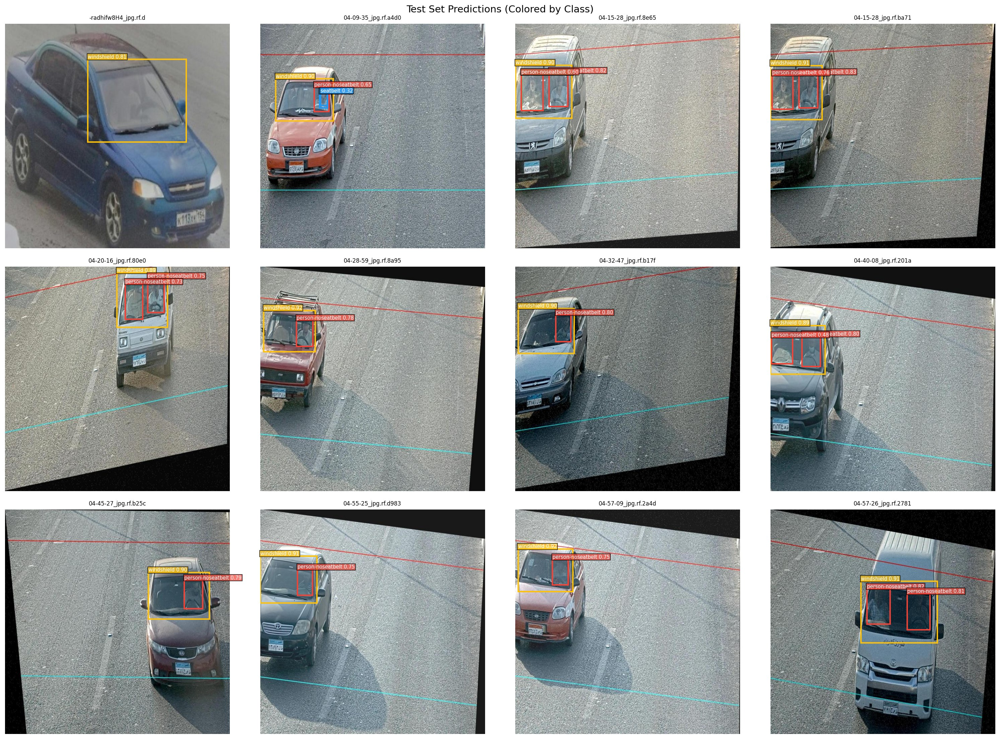
  <p><em>Figure 1: Real-World Vehicle Detection & Cabin Safety Enforcement — Multi-object test predictions localizing vehicles, windshields, seatbelt compliance, and driver violations in live traffic camera feeds.</em></p>
</div>

<div align="center">
  <table width="100%">
    <tr>
      <td width="50%" align="center">
        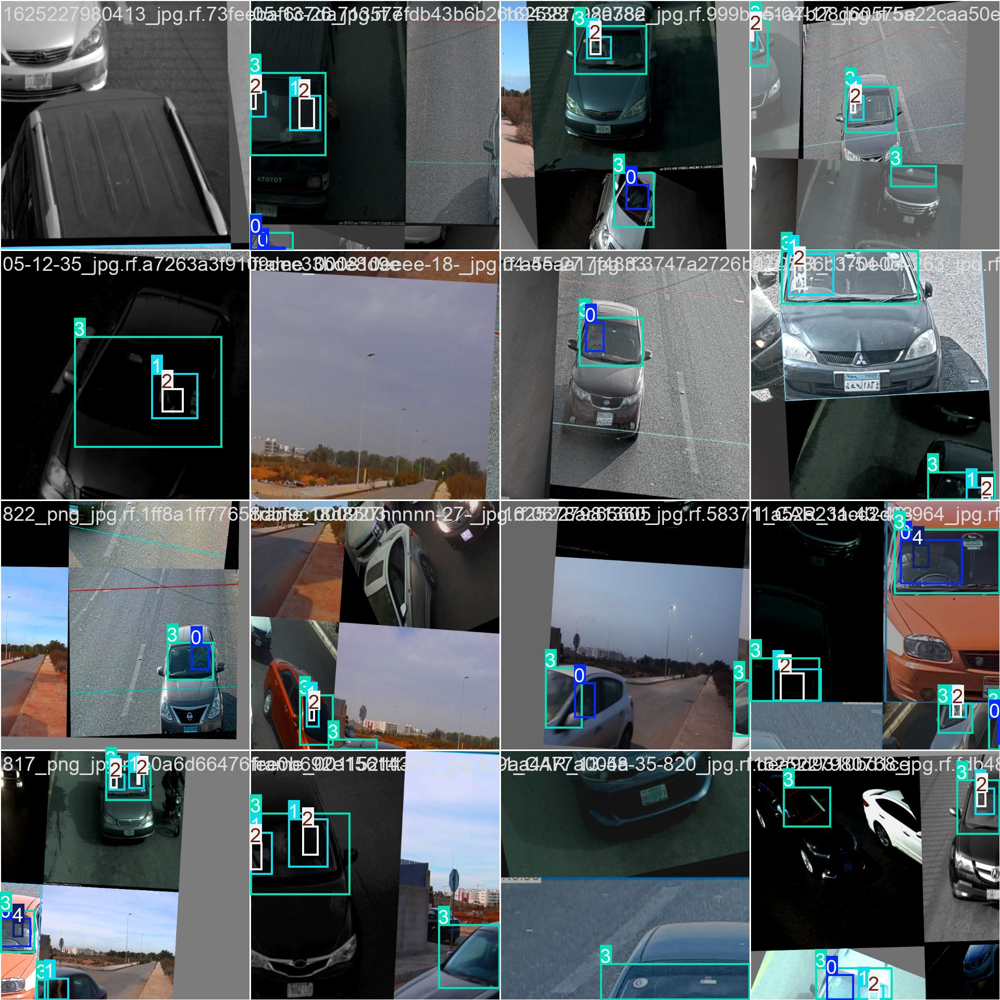
        <p><strong>Figure 2: Multi-Scale Mosaic Data Augmentation</strong><br/>Training-time 16-crop mosaic synthesis with perspective warping, lighting jitter, and scale transformations ensuring detection robustness under extreme sunlight, shadows, and highway speeds.</p>
      </td>
      <td width="50%" align="center">
        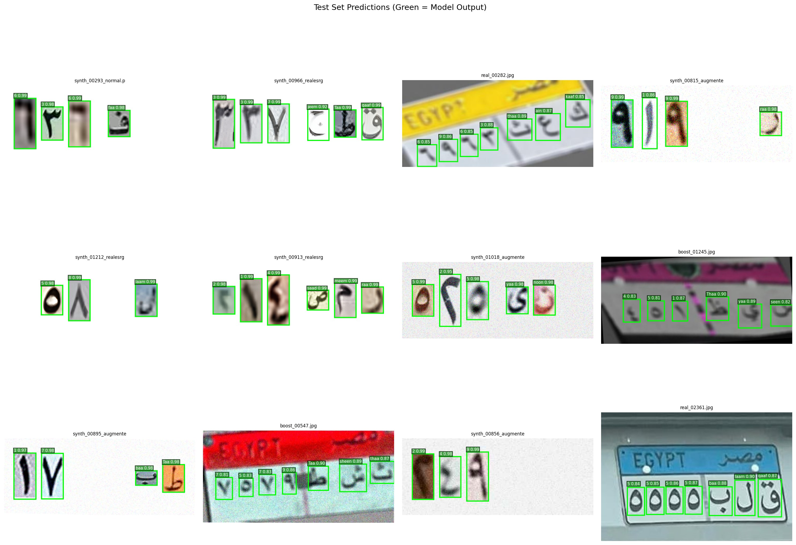
        <p><strong>Figure 3: Egyptian License Plate Character Extraction</strong><br/>High-confidence character localization and transliterated classification isolating Arabic letters and numerals with automated RTL/LTR directional sorting.</p>
      </td>
    </tr>
  </table>
</div>

---

## 📌 Executive Summary

Modern intelligent transportation systems (ITS) in high-density metropolitan environments face unique challenges: irregular plate wear, non-standard alphanumeric fonts, low-resolution roadside camera feeds, and extreme lighting variations. 

**RADAR** addresses these real-world constraints through a multi-stage neural cascade:
1. **Vehicle Detection & Multi-Object Tracking**: Identifies cars, trucks, and buses across frames using custom-tuned YOLO and ByteTrack.
2. **License Plate Localization**: Extracts license plate bounding boxes under challenging angles and aspect ratios.
3. **AI Super-Resolution Enhancement**: Restores blurry, degraded plate crops with **LapSRN** (Laplacian Pyramid) and **Real-ESRGAN** deep generative priors before character extraction.
4. **Arabic Character Recognition (OCR)**: Custom-trained YOLOv11 & YOLOv26 models classify Arabic letters and numerals with automated bidirectional alignment (Arabic letters RTL, numerals LTR).
5. **Driver Safety Enforcement**: Dual-head interior cabin classifier detecting seatbelt compliance and mobile phone distraction.
6. **Roboflow-Style Live Confidence Filtering**: Real-time client-side threshold filtering without redundant neural network re-inference.

---

## 🏗 System Architecture

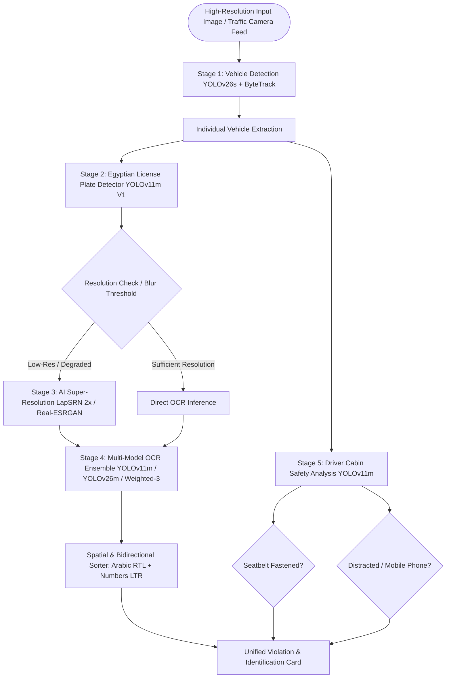

<details>
  <summary><b>📜 Click to expand: Official Scientific Conference Poster & Full System Blueprint (A1 Format)</b></summary>
  <br/>
  <div align="center">
    
    <p><em>Figure 4: Full System Blueprint & Scientific Poster — Architectural flow from vehicle localization to super-resolution OCR and cabin violation classification.</em></p>
  </div>
</details>

---

## 🔬 Key Engineering Innovations

### 1. Robust Egyptian License Plate OCR with Bidirectional Parsing
Egyptian license plates follow a complex dual-direction layout:
* **Arabic characters** appear on the right and read **Right-to-Left (RTL)**.
* **Arabic numerals** appear on the left and read **Left-to-Right (LTR)**.

Traditional general-purpose OCR models (Tesseract, standard EasyOCR) suffer severe character degradation due to font variances and non-Latin character spacing. RADAR treats character recognition as a **dense object detection task** (YOLO-based OCR):
* 27+ transliterated Arabic character classes (`alif`, `baa`, `jeem`, `daal`, etc.) + 10 numeric digits.
* Custom `separate_chars()` spatial parsing algorithm that sorts detected bounding boxes geometrically and applies correct linguistic directionality.

### 2. Dual Deep Super-Resolution Pipeline
When traffic cameras capture vehicles at distance, plate crops can be as small as $30 \times 15$ pixels, rendering character edges illegible. RADAR integrates two complementary super-resolution models:
* **LapSRN (Laplacian Pyramid Super-Resolution Network)**: High-speed progressive $2\times$ upsampling with Laplacian residual pyramids.
* **Real-ESRGAN**: Deep generative prior network with pure synthetic data degradation training, reconstructing clean sharp edges from noisy, low-resolution plate crops.
* The web interface provides an instant 3-way comparative view: **Original vs. LapSRN vs. Real-ESRGAN**.

### 3. Roboflow-Style Client-Side Confidence Filtering
Standard Streamlit applications re-trigger Python execution and re-run all heavyweight PyTorch models whenever a user tweaks a slider. RADAR implements an optimized caching strategy:
* Models run **ONCE** at a minimal confidence floor (`conf=0.01`).
* Raw tensor detections, bounding boxes, and logits are persisted in `st.session_state`.
* UI threshold sliders (Plate confidence, OCR confidence, Vehicle confidence, Violation confidence) filter the cached candidate detections **instantly (<5ms)** in memory with zero GPU recomputation.

### 4. Synthetic Data Augmentation & Class Re-balancing
Rare Arabic characters (such as `Thaa (ظ)`, `zaal (ذ)`, `ghayn (غ)`) suffer from natural frequency imbalances in road traffic. To solve this, a specialized dataset pipeline was engineered:
* `boost_weak_classes.py`: Targeted affine transformations, perspective skewing, and photometric noise injected specifically into minority character distributions.
* `yolo26m_ocr_char_training_cls_weighted-3`: Class-weighted cross-entropy loss that penalizes misclassifications on rare letter classes.

---

## 📊 Benchmarks & Quantitative Results

### License Plate Character OCR Model (YOLOv26m V2)

The character recognition model achieved state-of-the-art detection precision on Egyptian license plates:

| Metric | Score | Impact |
|:---|:---:|:---|
| **mAP @ 0.50** | **99.15%** | Near-perfect bounding box and character category identification |
| **Precision** | **98.91%** | Eliminates false-positive character reads |
| **Recall** | **98.98%** | Ensures minimal skipped letters in degraded plates |
| **mAP @ 0.50:0.95** | **77.43%** | High spatial IoU accuracy under severe perspective skew |

<div align="center">
  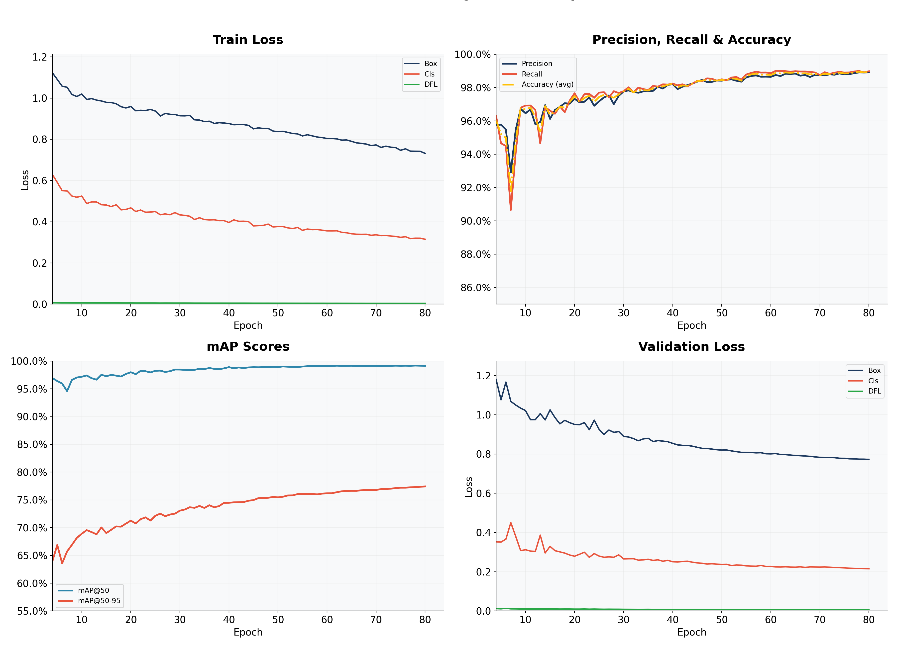
  <p><em>Figure 5: OCR Model Training Evolution — Box Loss, Classification Loss, DFL Loss, and Precision/Recall curves over 80 training epochs.</em></p>
</div>

<br/>

<div align="center">
  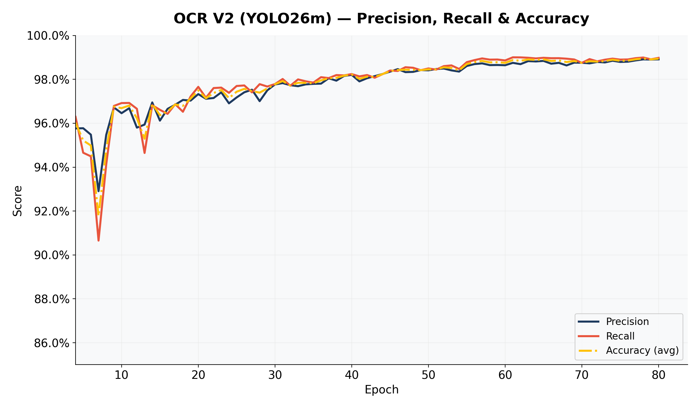
  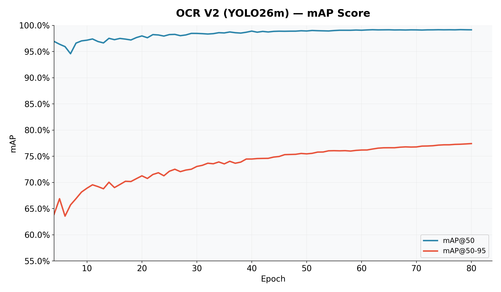
  <p><em>Figure 6: Detailed OCR Validation Dynamics — Left: Precision & Recall trajectories; Right: mAP@50 and mAP@50-95 convergence.</em></p>
</div>

<br/>

<div align="center">
  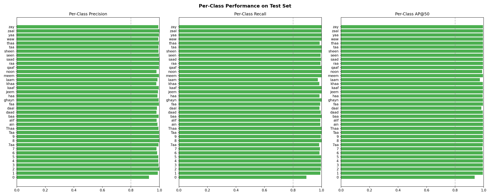
  <p><em>Figure 7: Granular Per-Class Character Performance — Precision, Recall, and mAP across all 38 Egyptian alphanumeric classes.</em></p>
</div>

---

### In-Cabin Violation Model (Seatbelt & Mobile Phone Detection)

Trained with multi-source cabin surveillance datasets to isolate driver posture and safety infractions:

| Metric | Score | Role |
|:---|:---:|:---|
| **mAP @ 0.50** | **89.49%** | Reliable violation tagging under varying window tint and shadows |
| **Precision** | **88.09%** | Robust protection against false penalty citations |
| **Recall** | **86.58%** | Captures obscured seatbelts and low-angle phone usage |
| **mAP @ 0.50:0.95** | **54.29%** | Tight bounding box localization on thin diagonal strap features |

<div align="center">
  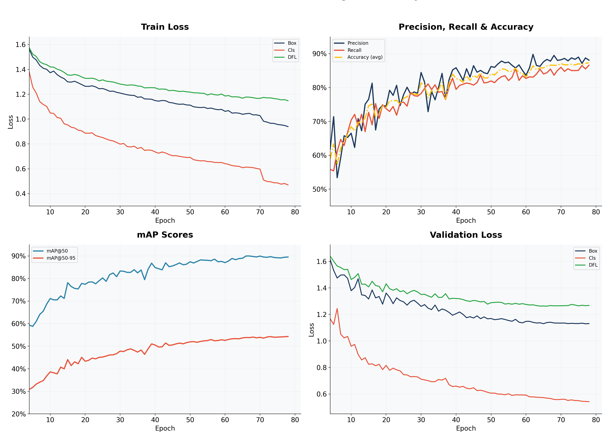
  <p><em>Figure 8: Cabin Safety Enforcement Model Metrics across 78 training epochs.</em></p>
</div>

<br/>

<div align="center">
  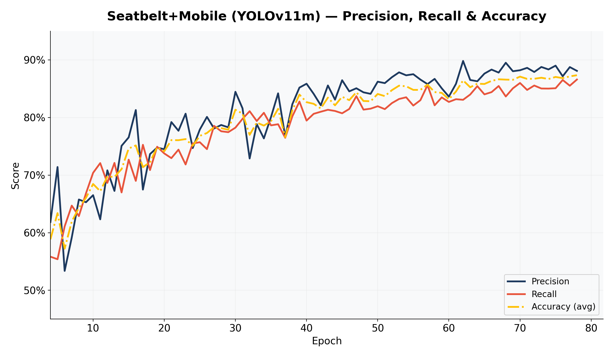
  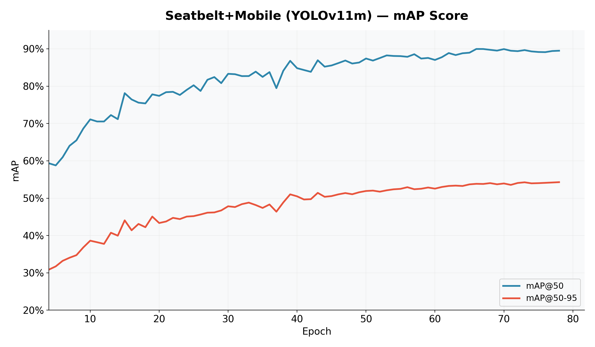
  <p><em>Figure 9: Precision, Recall, and mAP progression for Driver Safety Violation detection.</em></p>
</div>

<br/>

<div align="center">
  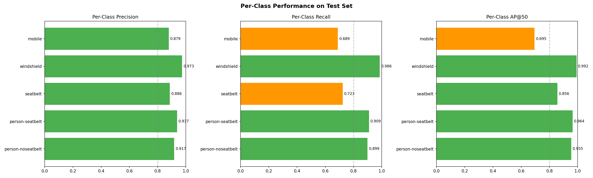
  <p><em>Figure 10: Per-Class In-Cabin Violation Metrics — Precision, Recall, and mAP breakdown across person-seatbelt, person-noseatbelt, and mobile phone usage.</em></p>
</div>

---

## 💻 Interactive Dashboard

The production Streamlit interface (`app.py`) provides an intuitive operations console for law enforcement and traffic monitoring:

* **Interactive Car Gallery & Selection**: Clickable vehicle cards allowing instant zoom into detected cars.
* **Super-Resolution Inspector**: Side-by-side comparison comparing raw crops vs. LapSRN vs. Real-ESRGAN.
* **Multi-Model OCR Selector**: Toggle between YOLOv11m, YOLOv26m, and YOLOv26m-Weighted-3.
* **Instant Visual Badges**: Color-coded safety tags for `Seatbelt OK`, `Seatbelt Violation`, and `Phone In Use`.
* **Sub-millisecond Slider Filtering**: Live confidence thresholding via sidebar controls.

---

## 📁 Repository Structure

```
RADAR/
├── app.py                          # Streamlit application entry point
├── config.py                       # System hyperparameters, model paths & Franco mapping
├── requirements.txt                # Production environment dependencies
│
├── core/                           # Core Machine Learning & Inference Pipeline
│   ├── model_manager.py            # Singleton model loader and GPU memory cache
│   ├── car_tracker.py              # YOLOv26s vehicle localization & ByteTrack
│   ├── plate_detector.py           # YOLOv11m Egyptian plate detection
│   ├── plate_ocr.py                # Multi-model character extraction
│   ├── enhancement.py              # LapSRN & Real-ESRGAN super-resolution modules
│   ├── seatbelt_detector.py        # Driver seatbelt and phone violation classifier
│   ├── plate_utils.py              # Spatial sorting & RTL/LTR Arabic reconstruction
│   ├── preprocessing.py            # Coordinate transformations & image normalization
│   └── pipeline.py                 # Multi-stage image analysis orchestrator
│
├── ui/                             # Dashboard Interface Layer
│   ├── photo_tab.py                # Photo inspection, car grid & violation reporting
│   └── display.py                  # Annotation rendering, badge display & comparisons
│
├── assets/                         # Visual Media & Documentation Assets
│   ├── charts/                     # Generated precision, recall, loss & mAP graphs
│   └── photos/                     # Real traffic validation images
│
├── presentation/                   # Scientific Communication Assets
│   ├── RADAR_poster_A1.png         # High-resolution scientific poster
│   ├── RADAR_poster_A1.pdf         # Print-ready vector conference poster
│   ├── RADAR.pptx                  # System walkthrough presentation deck
│   └── radar_poster_philosophy.md  # Design and visual architecture philosophy
│
└── training/                       # Research, Scripts & Experiments
    ├── notebooks/                  # Jupyter notebooks for model training & evaluation
    ├── scripts/                    # Dataset generation, augmentation & class boosting
    └── output/                     # Raw training logs, metrics CSVs & check-points
```

---

## 🚀 Quickstart

### Prerequisites
* Linux or Windows with Python 3.12+
* NVIDIA GPU with CUDA support recommended (CPU fallback supported)

### 1. Installation
```bash
# Clone the repository
git clone https://github.com/MarwanMesbah18/RADAR.git
cd RADAR

# Create and activate virtual environment
python3 -m venv venv
source venv/bin/activate  # On Windows: venv\Scripts\activate

# Install required dependencies
pip install -r requirements.txt
```

### 2. Model Checkpoints
Place model checkpoints into the `models/` directory:
* `yolo11m_car_plate_trained_V1.pt` (Plate Detector)
* `yolo26m_car_plate_ocr_V2.pt` (Plate OCR Model)
* `yolo26m_car_plate_ocr_V2_Weighted-3.pt` (Weighted OCR Model)
* `yolo26s_cars.pt` (Vehicle Detector)
* `seatbelt_mobile_v1.pt` (Violation Detector)
* `LapSRN_x2.pb` (LapSRN Model)

*(Note: Real-ESRGAN auto-downloads its weights on initial execution).*

### 3. Launch the Application
```bash
streamlit run app.py
```
Open your browser at `http://localhost:8501`.

---

## 👨‍💻 Author & Engineering Credits

**Marwan Mesbah**  
*Machine Learning & Computer Vision Engineer*  
* Specialized in Deep Learning, PyTorch, Real-Time Vision Systems, and Edge Deployment.
* Portfolio: [marwanmesbah18.github.io](https://marwanmesbah18.github.io)
* GitHub: [@MarwanMesbah18](https://github.com/MarwanMesbah18)
